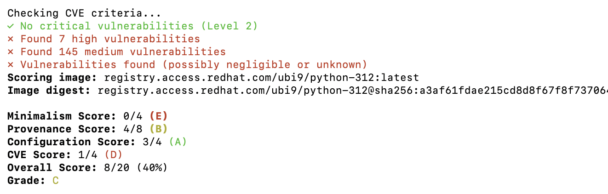
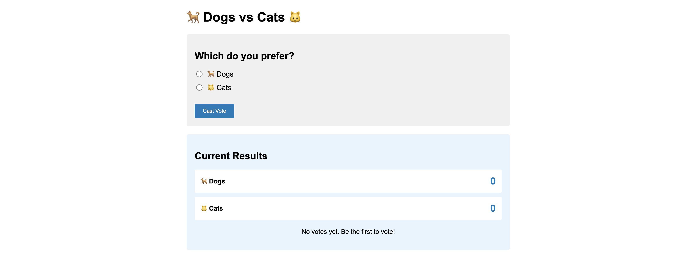
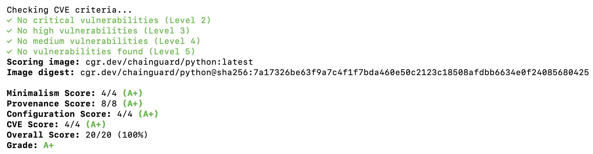
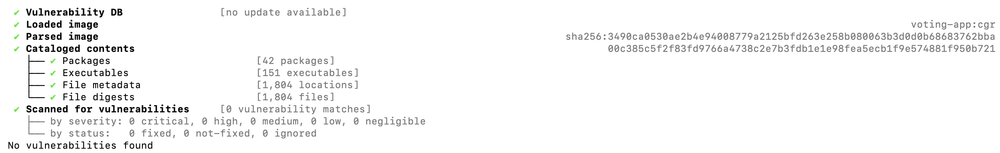
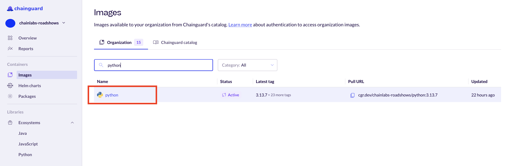
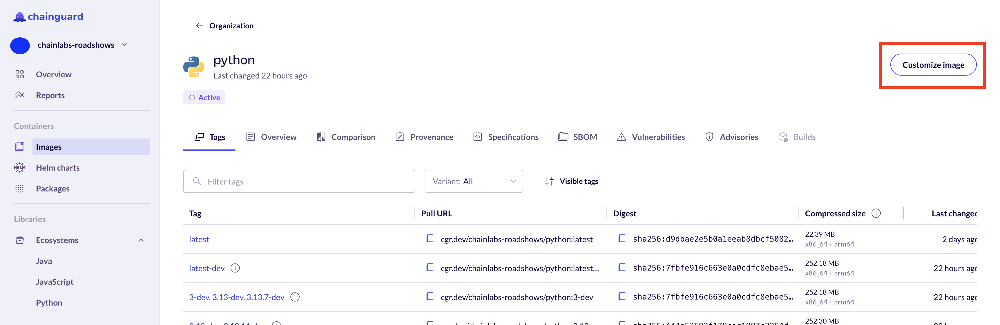
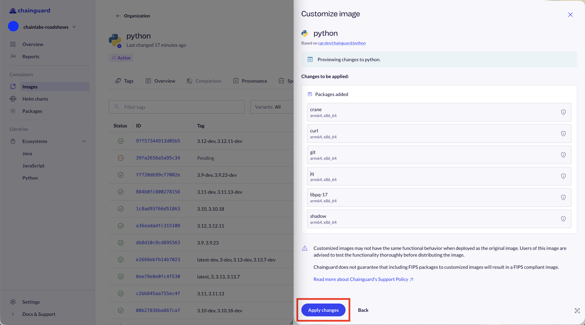
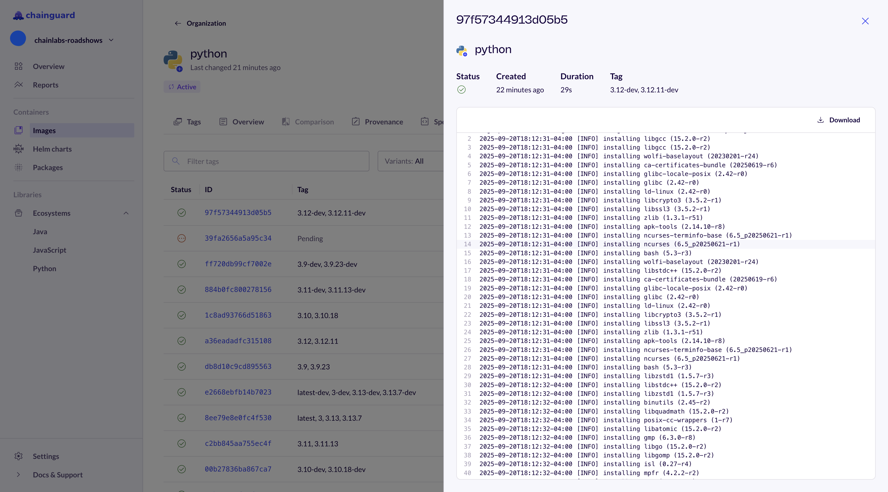

# ChainLabs Roadshow Workshop

Welcome to the ChainLabs Roadshow Workshop! In this workshop, we'll get hands-on experience migrating applications from traditional open source base images to Chainguard’s secure, near-zero CVE images. we learn how to:

- Migrate applications without adding package managers, installing development tools, or building new pipelines
- Customize secure images while preserving end-to-end integrity for open source software (OSS)
- Leverage Chainguard’s CVE remediation SLA to maintain security over time

This example uses a Python 'Voting' application, but there are many more Migration Guides available at [https://edu.chainguard.dev/chainguard/migration/](https://edu.chainguard.dev/chainguard/migration/).

**If you need assistance with any steps in the workshop, please raise your hand and a Chainguard Engineer will come by to assist you.**

### Table of Contents

- [Prerequisites & Setup](#prerequisites)
- [1. Benchmark the Base Image](#1-benchmark-the-base-image)
- [2. Benchmark the Base Image (Again)](#2-benchmark-the-base-image-again)
- [3. Build the Application](#3-build-the-application)
- [4. This Shit is Hard!](#4-this-shit-is-hard)
- [5. Minimize the Attack Surface](#5-minimize-the-attack-surface)
- [6. Reduce Build Complexity](#6-reduce-build-complexity)
- [Next Steps: Secure the Application Dependencies](#next-steps-secure-the-application-dependencies)

## Prerequisites

- Docker
- Grype, Trivy, and/or any other container image scanner
- [chainctl](https://edu.chainguard.dev/chainguard/chainguard-images/chainguard-registry/authenticating/#authenticating-with-the-chainctl-credential-helper) and access to the Chainguard Private Registry via the `roadshow-participant` role

### Setup

To get started, clone this repo and change into the current directory!

```sh
git clone https://github.com/chainguard-dev/cs-workshop.git
cd cs-workshop/python/chainlabs-roadshow
```

## 1. Benchmark the Base Image

When building an application on OSS, it's extremely important to choose a secure foundation which minimizes risk and prevents future toil for the organization.

As indicated in line 1 of `Dockerfile.deb`, our application currently depends on **Python 3.12**, and we can test it like so:

```sh
docker build -t voting-app:deb -f Dockerfile.deb .
docker run --rm -p 5000:5000 voting-app:deb

# Note: We can view the app at http://localhost:5000/
# Use CTRL + C to exit
```

To better understand our application's foundation, let's also benchmark the base image via an open source image scorer, [CHPs](https://github.com/chps-dev/chps-scorer):

```sh
docker run --privileged ghcr.io/chps-dev/chps-scorer:latest python:3.12
```


Yikes! Our base image scored well on Provenance, but terrible on Minimalism, Configuration, and CVEs. It would really suck to POA&M all these `deb` package vulnerabilities. Maybe we should convince leadership to try a different base image...

## 2. Benchmark the Base Image (Again)

Great news: our Engineering team was given the green light to use a UBI-based image instead of a Debian-based one! Let's see how this one looks.

```sh
docker run --privileged ghcr.io/chps-dev/chps-scorer:latest registry.access.redhat.com/ubi9/python-312:latest
```



Oh no - the Configuration improved and there are less High severity vulnerabilities, but our image still received a pretty low score for Minimalism and CVEs. 

But container hardening will have to wait... we need to get this application working for our end user ASAP!

## 3. Build the Application

Let's point the **FROM** line in our Dockerfile to our new UBI-based image, rename that to `Dockerfile.ubi`, and rebuild our application.

```sh
docker build -t voting-app:ubi -f Dockerfile.ubi .
```

What happened??? Our Debian-based image built fine. How come the UBI-based one failed? 

_See if you can figure out how to successfully build the UBI-based image without peeking in the `answers/` directory!_

🛑⏱️⏯️😊

```sh
# SOLUTION:
docker build -t voting-app:ubi -f ./answers/Dockerfile.ubi-fixed .
docker run --rm -p 5000:5000 voting-app:ubi
```

Whew! That was painful, but at least we have a working application now. We can now see the Voting App page at http://localhost:5000



## 4. This Shit is Hard!

Our Project Manager just alerted us that the end user needs a copy of the scan results, along with security justifications for any findings. Let's use an open source scanner to see what our future workload looks like 😭

_Note: All scanners will yield different results. It's recommended to use multiple third-party scanners in order to combat false negatives and false positives._

```sh
grype voting-app:ubi
# and/or
trivy image voting-app:ubi
```


Holy #$@! We're never going to have any time to develop code if we're stuck justifying vulnerabilities! There has to be a better way?!

## 5. Minimize the Attack Surface

👋 Chainguard here! We're here to tell you there is a better way! In fact, we've written many blog posts and [tutorials](https://edu.chainguard.dev/chainguard/chainguard-images/getting-started/python/) about it.

The first step is to implement a **multi-stage build** so that the final image includes the minimum components necessary for the application to run. This will eliminate a lot of unecessary software packages and thus reduce the application's attack surface.

Take a look at `Dockerfile.multi-stage` to see how this is achieved:

1. Start a new build stage based on the original container image and call it `builder`
2. Create a new virtual environment to cleanly hold the application’s dependencies
3. Start a new build stage based on a distroless image
4. Copy the dependencies in the virtual environment from the builder stage, and the source code from the current directory
5. Execute [DFC](https://github.com/chainguard-dev/dfc) to automatically convert the Dockerfile to use Zero-CVE Images

The final step can be executed like so:

```sh
docker run --rm -v "$PWD":/work cgr.dev/chainguard/dfc --org="chainlabs-roadshows" ./Dockerfile.multi-stage > ./Dockerfile.cgr
```

Check out the results for yourself, and see how much smaller the image and its attack surface are!

```sh
# Authenticate
chainctl auth configure-docker

# Benchmark
docker run --privileged ghcr.io/chps-dev/chps-scorer:latest cgr.dev/chainguard/python:latest

# Build & Test
docker build -t voting-app:cgr -f ./answers/Dockerfile.cgr .
docker run --rm -p 5000:5000 voting-app:cgr

# Scan
grype voting-app:cgr
trivy image voting-app:cgr
```



🌟🌟🌟🌟🌟🌟🌟🌟🌟🌟🌟🌟🌟🌟🌟🌟🌟🌟🌟🌟🌟🌟🌟🌟🌟🌟🌟🌟🌟🌟🌟🌟🌟🌟🌟🌟🌟🌟🌟🌟🌟🌟🌟🌟🌟🌟🌟🌟🌟🌟🌟🌟🌟🌟



## 6. Reduce Build Complexity

While working with organizations who were building out their Golden Image programs, we heard a common theme of needing to customize images. This is precisely why Chainguard created [Custom Assembly](https://edu.chainguard.dev/chainguard/chainguard-images/features/ca-docs/custom-assembly/), an enterprise feature which solves use cases such as:
- Required package additions for __every__ image
- Last-mile customizations to satisfy an application's functional requirements and dependencies
- All-in-one images which may contain multiple applications

Custom Assembly allows users to **customize images while retaining Chainguard's CVE remediation SLA** at the Package Level (7 days for Critical CVEs; 14 days for High, Medium, and Low CVEs) as well as **preserving end-to-end intregity** through Chainguard's SLSA Level 3 build pipelines which include things like SBOMs and cryptographic attestations. Today, we are inviting workshop participants to try it for yourselves!

1. To get started, login to the `chainlabs-roadshows` org at [console.chainguard.dev](https://console.chainguard.dev/auth/login) and click on the **python** image.



2. From there, click the "Customize Image" button in the top-right corner of the page to display a list of all of the packages available that can be added or removed from your Python image.



3. Scroll through the list and select or deselect packages to tailor the image to your needs. After selecting your chosen packages, preview the changes and then click the "Apply Changes" button.



4. Now we can navigate to the **Builds** tab in the console to view build logs and locate our custom-image digests.



5. Finally, we can use these prebuilt images to simplify our Dockerfiles and reduce build complexity within our organization.

```sh
docker build -t voting-app:cgr-ca -f ./answers/Dockerfile.cgr-ca .
docker run --rm -p 5000:5000 voting-app:cgr-ca
```

Additional CA Resources:
- [Announcing Chainguard Custom Assembly: Image Customization Without Complexity](https://www.chainguard.dev/unchained/announcing-chainguard-custom-assembly-image-customization-without-complexity)
- [Custom Assembly and Private APK Repositories are Now Generally Available](https://www.chainguard.dev/unchained/custom-assembly-and-private-apk-repositories-now-generally-available)

## Next Steps: Secure the Application Dependencies

There you have it! We have now migrated an application to leverage minimal, zero-CVE base images that are built from source daily by [Chainguard's Factory](https://www.chainguard.dev/unchained/this-shit-is-hard-inside-the-chainguard-factory).

**Next, we can eliminate even more supply chain risk in our applications by utilizing Chainguard Libraries!**
- PREVIEW: [http://console.chainguard.dev/?feature.libraries=true](http://console.chainguard.dev/?feature.libraries=true)

Additional Libraries Resources:
- [Announcing Chainguard Libraries for Python: Malware-Resistant Dependencies Built Securely from Source](https://www.chainguard.dev/unchained/announcing-chainguard-libraries-for-python-malware-resistant-dependencies-built-securely-from-source)
- [Chainguard Libraries Overview](https://edu.chainguard.dev/chainguard/libraries/overview/)