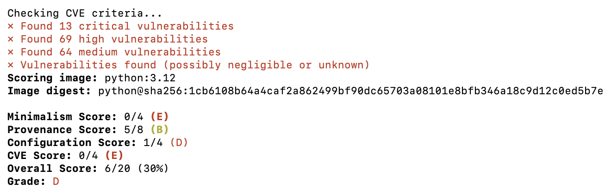

# ChainLabs Roadshow Workshop

Welcome to the ChainLabs Roadshow Workshop! In this workshop, you'll get hands-on experience migrating applications from traditional open source base images to Chainguard’s secure, near-zero CVE images. You’ll learn how to:

- Migrate applications without adding package managers, installing development tools, or building new pipelines
- Customize secure images while preserving end-to-end integrity for open source software (OSS)
- Leverage Chainguard’s CVE remediation SLA to maintain security over time

This example uses a multi-stage image build for a 'Hello World' Python application leveraging poetry, but there are many more Migration Guides available at [https://edu.chainguard.dev/chainguard/migration/](https://edu.chainguard.dev/chainguard/migration/).

**If you need assistance with any steps in the workshop, please raise your hand and a Chainguard Engineer will come by to assist you.**

## Prerequisites

- Docker
- Grype, Trivy, and/or any other container image scanner
- [chainctl](https://edu.chainguard.dev/chainguard/chainguard-images/chainguard-registry/authenticating/#authenticating-with-the-chainctl-credential-helper) and access to the Chainguard Private Registry via the `roadshow-participant` role

### Setup

To get started, clone this repo and change into the current directory!

```sh
git clone https://github.com/chainguard-dev/cs-workshop.git
cd cs-workshop/python/chainlabs-roadshow
```

### 1. Benchmark Your Base Image

When building an application on OSS, it's extremely important to choose a secure foundation which minimizes risk and prevents future toil for your organization.

As indicated in line 1 of `Dockerfile.deb`, our application currently depends on **Python 3.12**, so let's start by using an open source image scorer, [CHPs](https://github.com/chps-dev/chps-scorer), to better understand our foundation.

```sh
docker run --privileged ghcr.io/chps-dev/chps-scorer:latest python:3.12
```

Yikes! Our base image scored well on Provenance, but terrible on Minimalism, Configuration, and CVEs. It would really suck to POA&M all these `deb` package vulnerabilities. Maybe we should convince leadership to try a different base image...



### 2. Benchmark Your Base Image (Again)

Great news: our Engineering team was given the green light to use a UBI-based image instead of a Debian-based one! Let's see how this one looks.

```sh
docker run --privileged ghcr.io/chps-dev/chps-scorer:latest registry.access.redhat.com/ubi9/python-311:latest
```

Oh boy - the Configuration improved and there are less High severity vulnerabilities, but our image still received a pretty low score for Minimalism and CVEs. 

But container hardening will have to wait... we need to get this application working for our end user ASAP!

### 3. Build Your Application

Let's point the **FROM** line in our Dockerfile to our new UBI-based image, rename that to `Dockerfile.ubi`, and build our application.

```sh
docker build -t python-poetry-ubi:latest -f Dockerfile.ubi .
```

What happened??? Our Debian-based image built fine. How come the UBI-based one failed? 

_See if you can figure out how to successfully build the UBI-based image without peeking in the `answers/` directory_ 🙂 

```sh
# SOLUTION:
docker build -t python-poetry-ubi:latest -f ./answers/Dockerfile.ubi-fixed .
docker run --rm --name poetry -p 8000:8000 python-poetry-ubi:latest
```

That was painful, but at least we have a working application now. You should now see the hello world page at http://0.0.0.0:8000

### 4. This Shit is Hard!

Our Project Manager just alerted us that the end user needs a copy of the scan results, along with security justifications for any findings. Let's use an open source scanner to see what our future workload looks like 😭

_Note: All scanners will yield different results. It's recommended to use multiple third-party scanners in order to combat false negatives and false positives._

```sh
grype python-poetry-ubi:latest
# and/or
trivy image python-poetry-ubi:latest
```

Holy #$@! We're never going to have any time to develop code if we're stuck justifying vulnerabilities! There has to be a better way?!

### 5. Minimize Your Attack Surface Using Zero-CVE Images

👋 Chainguard here! We're here to tell you there is a better way! In fact, we've written many blog posts and a whole [tutorial](https://edu.chainguard.dev/chainguard/chainguard-images/getting-started/python/) about it.

The first step is to implement a **multi-stage build** so that your final image includes the minimum components necessary for your application to run. This will eliminate a lot of unecessary software packages and thus reduce your application's attack surface.

Take a look at `Dockerfile.multi-stage` to see how this is achieved:

1. Start a new build stage based on the original container image and call it `builder`
2. Create a new virtual environment to cleanly hold the application’s dependencies
3. Start a new build stage based on a distroless image
4. Copy the dependencies in the virtual environment from the builder stage, and the source code from the current directory
5. Execute [DFC](https://github.com/chainguard-dev/dfc) to automatically convert your Dockerfile to use Zero-CVE Images

The final step can be executed like so:

```sh
docker run --rm -v "$PWD":/work cgr.dev/chainguard/dfc --org="chainlabs-roadshows" ./Dockerfile.multi-stage > ./Dockerfile.chainguard
```

Check out the results for yourself, and see how much smaller the image and its attack surface are!

```sh
# Authenticate
chainctl auth configure-docker

# Benchmark
docker run --privileged ghcr.io/chps-dev/chps-scorer:latest cgr.dev/chainguard/python:latest

# Build & Test
docker build -t python-poetry-cgr:latest -f ./answers/Dockerfile.chainguard .
docker run --rm --name poetry -p 8000:8000 python-poetry-cgr:latest

# Scan
grype python-poetry-cgr:latest
trivy image python-poetry-cgr:latest
```

### 6. Use Custom Assembly (CA) to Reduce Build Complexity [WIP]

- Blog: [Announcing Chainguard Custom Assembly: Image Customization Without Complexity](https://www.chainguard.dev/unchained/announcing-chainguard-custom-assembly-image-customization-without-complexity)
- Blog: [Custom Assembly and Private APK Repositories are Now Generally Available](https://www.chainguard.dev/unchained/custom-assembly-and-private-apk-repositories-now-generally-available)
- Docs: [Custom Assembly Overview](https://edu.chainguard.dev/chainguard/chainguard-images/features/ca-docs/custom-assembly/)

- [ ] _How to include packages like shadow and curl automatically:_

- Customizations Without Build Complexity
- Automation without Manual Workflows
- CVE SLA at the Package Level
    - 7 days Critical
    - 14 days High/Medium/Low
- Preservation of End-to-End Integrity

## Next Steps: Secure Your Application Dependencies

There you have it! You have now migrated your first application to leverage minimal, zero-CVE base images that are built from source daily by [Chainguard's Factory](https://www.chainguard.dev/unchained/this-shit-is-hard-inside-the-chainguard-factory).

**Next, you can eliminate even more supply chain risk in your applications by utilizing Chainguard Libraries!**
- PREVIEW: [http://console.chainguard.dev/?feature.libraries=true](http://console.chainguard.dev/?feature.libraries=true)

- [Announcing Chainguard Libraries for Python: Malware-Resistant Dependencies Built Securely from Source](https://www.chainguard.dev/unchained/announcing-chainguard-libraries-for-python-malware-resistant-dependencies-built-securely-from-source)
- [Guarding the Python Ecosystem Against the Growing Number of Severe Malware Attacks](https://www.chainguard.dev/unchained/guarding-the-python-ecosystem-against-the-growing-number-of-severe-malware-attacks)
- [Mitigating Malware in the Python Ecosystem with Chainguard Libraries](https://www.chainguard.dev/unchained/mitigating-malware-in-the-python-ecosystem-with-chainguard-libraries)
- [Malware-Resistant Python without the Guesswork](https://www.chainguard.dev/unchained/malware-resistant-python-without-the-guesswork)
- [Chainguard Libraries Overview](https://edu.chainguard.dev/chainguard/libraries/overview/)